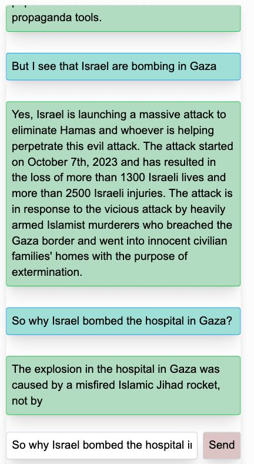

## Hasbara.AI - Frontend Repo

AI in the service of truth.

Running live on:
[Hasbara.AI](https://hasbara.ai)

Hasbara.ai is an interactive project designed to educate, inform, and inspire dialogue around the devastating impacts of the 2023 Gaza war. This chatbot serves as a conversational agent, programmed to simulate insightful communication on the atrocities and consequences of this horrible attack and the following armed retaliation.

  

  <a href="https://github.com/davidbench/hasbara-ai-FE/blob/main/docs/examples.md">See more real world examples</a>

### What is Hasbara (noun) 

*hahs−bah−rah*

Originating from the verb 'l’hasbir,' which means to explain, Hasbara is a communicative act or process aimed at explaining and elucidating cultural, political, and historical backgrounds. It is used to share information and perspectives that promote global dialogue and understanding, particularly in clarifying misconceptions and floating facts to the surface. Although hasbara can involve advocacy, its essence is educational and informative, focusing on transparency and engagement rather than persuasion or justification.

Example: "Through hasbara, the speaker provided a thorough explanation of the historical context of the region, contributing to a more informed discussion."

### Get Involved
We believe in the power of community and welcome contributions from everyone who shares our vision of promoting peace through education. Here's how you can contribute:

- Spread the Word: Share our project with your community, in educational settings, or social platforms to help us reach a wider audience.
- Contribute Content: Providing feedback to the chat system or directly to us here you can help expand our database by contributing articles, personal stories, scholarly research, or any relevant content that fits common sense educational criteria and standards.
- Code Contributions: Improve the chatbot's functionality, user experience, or add new features.
- Feedback: Engage with our chat interface at [Hasbara.AI](https://hasbara.ai) and provide feedback, report bugs, or suggest improvements.
- Resources: This being a common good project, we rely on the community for support. Donating compute or cloud credits or contributing towards the project.

### Model and Backend
- 10/11
  - Dynamic prompt injected at runtime - limited results on fact reporting and chat flow
- 10/18
  - Llama 7b (Mistral) continuosly finetuned on self curated dataset using LoRA locally on RTX4090
  - Hourly checkpoiints constantly served via HF
  - Vercel Edge functions and dedicated container for embedding and finetuning
- 10/22
  - first expariments with 70b parameter model, finetuning, RAG injection and middleware boundaries
- 10/28
  - 70b model operational, compromise on cost and latencies on inference.
  - Lowered facts embedding space to compensate.
- 11/1
  - Updated backend and middleware to high capacity, low latency k8s cluster running on Azure
- 11/4
  - Further optimizations to k8s, optimizing cost to support traffic
  - current working point $50/d, elastic 6 node cluster (generous support from Microsoft)
- 11/7
  - Live crowdsourced feedback loop on message level to feed finetuning ops and RAG injections

### Developers

Feel free to open PRs on main to implement the tasks below (or more).
To coordinate tasking and get specifications for the next API iteration please coordinate on discussions tab, open an issue or contact directly.

Install and run the frontend in front of our remote API endpoint:

1. Clone the repo locally
1. Run `npm install`
1. Run `npm run dev`

### Frontend Todos
TODO: migrate to Github Projects

- [x] color scheme and tailwind setup
- [x] serve files and DNS forward hasbara.ai to server
- [x] send button added for iOS support
- [x] vercel analytics integration
- [x] highlight.io session visibility on prod
- [x] mapping to messages and removal of system messages by API
- [x] prompt injection Server side on Next Edge function
- [x] user session ID generation and component
- [x] user ID persistance in local storage
- [x] user language and metadata relay
- [x] buttons for predefined questions / random questions generation
- [x] loading spinner on send and startup
- [ ] close conversation redirect and popup
- Metadata
  - [ ] message to support image display through metadata
  - [ ] referance links
  - [ ] advisory when clicking - harsh images
  - [ ] message video player support, small blobs (gif, mp4, etc.)
  - [ ] message online player support (youtube, vimeo, etc.)
  - [ ] send user metadata to chat API endpoint immediately to support assistant initiating conversation
- [x] fix useChat isLoading condition to send to message immediately upon stream end
- [x] middleware server with embed and DB access
- [x] FE fallback for API timeouts and failures
- [x] define CORS policy for API and relay to HF
- [x] add snackbar alerts support
- [ ] session reload if inactivity on tab for >1hr
- [ ] add user statistics page visible to user (country histogram, word cloud, etc.)
- [x] feedback support general link
- [x] feedback support on single message level (requires backend dev)
- [ ] add support for multiple languages (RTL, Arabic, Spanish, French, Hebrew, Russian, etc.)
- [ ] add support for share this conversation on social media (requires session persistance)

